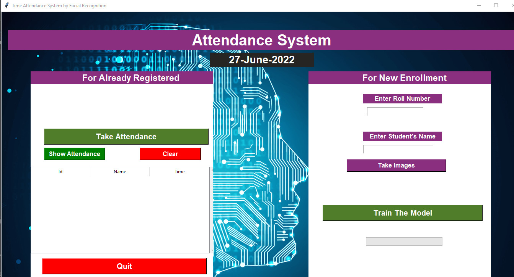
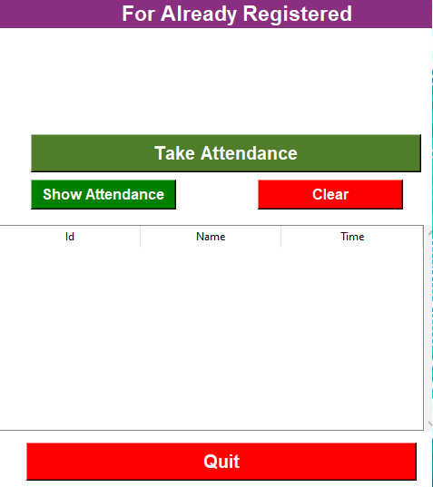
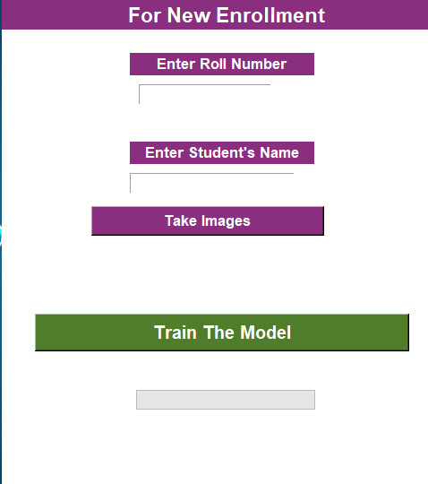
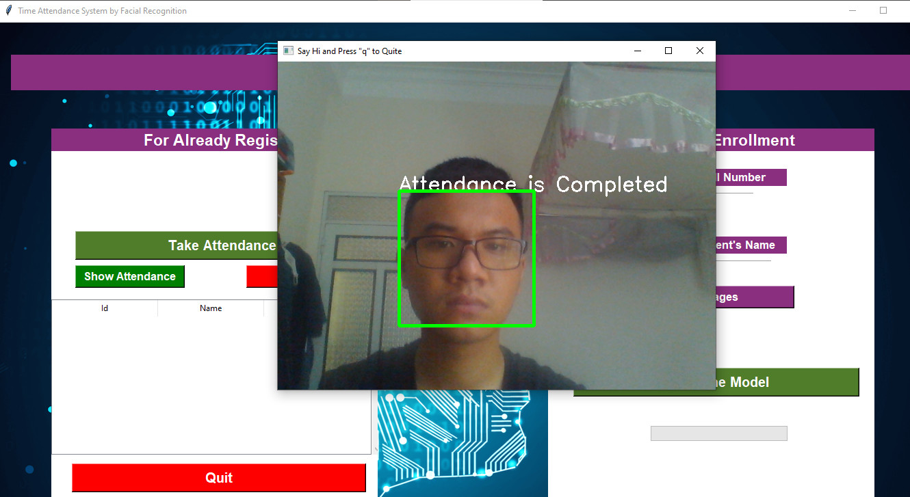

# AIP391 Time attendance system by facial recognition
This is the overview of the UI

The project is divided into the following sections:
1. Generating Training data/ Students pic and enrolling them in MongoDB database in all the collections a CSV file named Students Enrollment
2. Once the required dataset is generated the model is trained which comprises of several layers with softmax in the output layer
3. The user can then take the attendance by clicking on the required button. It takes approximately 15 seconds to start the attendance window. 

# - **Prequisites:**

Install the packages mentioned in Requirements folder depending on CPU/ GPU based systems.

## **How to use the UI?**
(UI is made using python Tkinter)

**Warning: Make sure that the students are enrolled sequentially starting from Roll Number 1 and make sure that duplicated Roll number is not inserted**

Step 1: Run Python3 UI.py  
Step 2: Once the UI is up and running, start with the right-hand section for new enrollments

)

Step 3: Clik on the Take Images button, A new window (frame) should open and clicks 30 images of the detected face 
Step 4: Once the students are enrolled, you can check the attendance in the Students_Enrollment.CSV 
Step 5: Click on Train the Model. Here I have used multi-threading, thread 1 for the progress bar, and thread 2 for model training.  
Step 6: The model will be trained in backend and saved into the Model directory as a .model file. 
Step 7: You can now jump on to the left section for taking attendance. 
Step 8: After verifying the existing attendance, click on "Take Attendance" 
Step 9: The model will take approximately 15 secs to start now and a new window will be displayed. 
Step 10: The window will capture the attendance of the recognized face for only 1 time for the desired class. 
Step 11: When the attendance is taken, you can click on show attendance and the updated attendance/class. 
Step 12: For reference, the attendance is stored in both MongoDB and the CSV files
Step 13: Click on Quit to close the window.

Diving deep into the process: 

# - **Generating the training dataset/ Students database**

1. The student's input is taken from the Tkinter UI using a text field and a function is called in Generate_Dataset.py file. The code pops up a window frame. 
2. As soon as the user inputs the details (Name and Roll Number) the data is saved in the MongoDB database using Pymongo 
3. After the students are enrolled in Mongo they are appended in a CSV file "Student_Enrollment.CSV"(This file is important as the number of classes in Recognizer are derived from here) 
4. Then, the names folders/directories are created in the people folder with "roll number"+"name" format 
5. Faces of students are detected in real-time using Harcascade classifier in OpenCV2 (Faces.xml) 
6. The pictures are stored in increasing digits order( 30 Pictures per person are taken as of now) 
7. After taking 30 images the window(frame) is automatically destroyed 
8. Following the above steps, new students can be enrolled 

# - **Model Training**

1. After taking pictures of the desired students now you can click on Train the model Button 
2. The control is shifted to ModelTraining() function in Model_train.py 
3. Number of classes are then calculated by reading the Student_Enrollment.csv using pandas and calculating the shape[0] 
4. Learning rate is set to 0.01, epochs to 400 and batch_size to 16, hyperparameters can be further tweaked for better performance 
5. Then the folders from People folder are sorted and read to extract the images 
6. Images are resized to (160,160) then embeddings are extracted using pre-trained model "facenet_keras.h5" 
7. The embeddings are appended to a list and then converted to NumPy array for Training 
 
8. The model takes around 30-40 seconds for training and saved as "Face_recoginition. Model" in the Model directory 

# - **Face Recognition/ Take Attendance**
1. You can click on Take attendance
 

2. The control is shifted to Recognition() function in Recognizer.py
3. The labels are created in a dictionary with value 0 for all the names of students(names are extracted from people folder)
4. Then a window is popped which detects the face in realtime with the same CV2 haar cascade classifier followed by extraction of embeddings  
5. If the output value is more than 0.85(hardcoded) then a respective class is matched against that value. 
6. I have created an empty dictionary initializing 0 values for all the students. Every time the face is matched with the label the value is incremented by 1 value. Once this value reached to 30(hardcoded) "Attendance is completed" is displayed on the header of the frame 
7. When the threshold reaches 30, for all the present students the data is updated in MongoDB table using Data.update
8. For MongoDB, the control is shifted to retrieve_pymongo_data.py where the Database and collections are pulled based on the subject and updated
9. Export CSV function saves the MongoDB data to CSV files for English and Hindi folders respectively. 
10. "q" key on the keyboard can be used to exit the window. 
11. Quit can be used to exit the Tkinter UI. 

